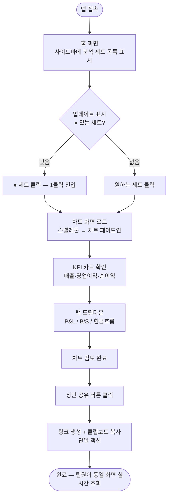
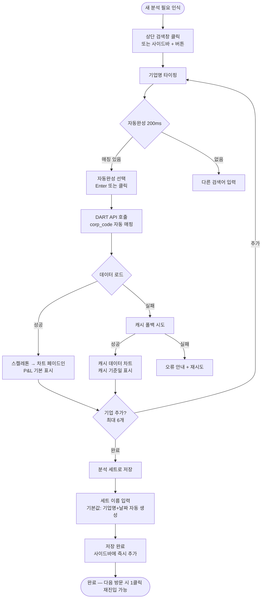
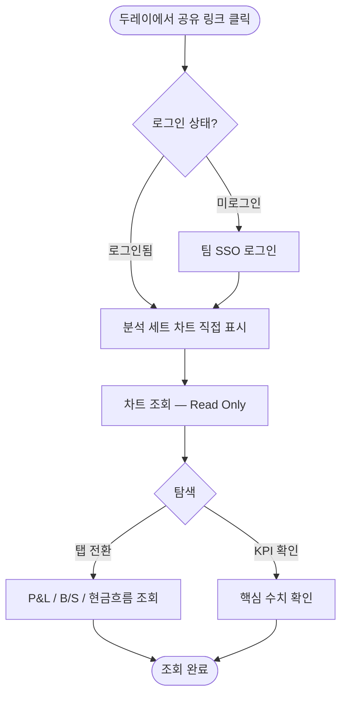

# UX Design Specification my-bmad-project

**Author:** juno
**Date:** 2026-03-04

---

<!-- UX design content will be appended sequentially through collaborative workflow steps -->

## Executive Summary

### Project Vision

전략기획팀 5명 전용 내부 기업 분석 대시보드. DART 공시 데이터 자동 수집부터 비교 차트 생성·공유까지 전 과정을 자동화하여, 팀의 핵심 수고로움인 "매번 처음부터 조립하는 반복 작업"을 제거한다.

### Target Users

**주 사용자 — Builder (전략기획팀원):**
노트북 + 외부 모니터 환경, 주 1회 내외 사용. 분기 실적 발표 시즌에 집중 사용하며, 저장된 분석 세트를 바로 불러와 최신 데이터로 업데이트하는 패턴.

**팀 관리자 — Admin:**
팀원 초대·역할 관리. 모든 분석 세트에 접근 가능.

**결과 수신자 — Live Viewer / Read Only:**
공유 링크 또는 권한 내 읽기 전용 조회. 직접 분석 세트 생성 없음.

### Key Design Challenges

1. **즉시 재진입 UX**: 주 1회 접속 시 "내 분석 세트"로 마찰 없이 복귀. 홈 화면이 기억 부담 없이 현재 상태를 즉시 파악 가능해야 함.
2. **데이터 밀도 vs 심플함**: 5년치 × 최대 6개 기업을 핵심 지표 중심으로 표현. 과부하 없이 드릴다운 가능한 계층 구조.
3. **분석 세트 직관성**: 저장-재사용-자동 갱신 개념이 Spotify 플레이리스트처럼 자연스럽게 느껴지도록.

### Design Opportunities

1. **플레이리스트형 홈**: 저장된 분석 세트 리스트 즉시 노출 + 새 분기 데이터 업데이트 세트에 ● 표시 → 분기 시즌 재진입 1클릭.
2. **2-패널 와이드 레이아웃**: 좌측 네비게이션 + 우측 대형 차트 공간. 외부 모니터 환경에 최적화.
3. **원클릭 공유**: 두레이 공유 링크 생성을 차트 화면 상단 단일 버튼으로.

## Core User Experience

### Defining Experience

**핵심 루프:**
저장된 분석 세트 클릭 → 최신 차트 확인 → 공유

분기 시즌에 Builder가 앱을 열면 홈에서 저장된 세트를 클릭하고, 새 분기 데이터가 반영된 차트를 확인한 뒤, 두레이에 링크를 공유하는 것이 가장 빈번한 완전한 흐름. 신규 기업 탐색("검색 → 차트")은 덜 빈번하지만 제품의 핵심 가치 증명 순간.

### Platform Strategy

- **플랫폼:** Web App (브라우저 전용, Next.js 14)
- **기준 해상도:** Desktop-first (1440px+), 노트북 단독 사용 시에도 지원
- **인터랙션:** Mouse + Keyboard 기본, 터치 미지원
- **연결성:** 온라인 전용 — DART 데이터 상시 연결 전제, 오프라인 불필요
- **모바일 대응:** 없음 (내부 업무 전용 툴)

### Effortless Interactions

1. **자동 기업 매핑** — 기업명 타이핑 시 corp_code 자동 매핑, 사용자가 DART 코드를 몰라도 즉시 데이터 로드
2. **분석 세트 자동 갱신** — 세트를 열면 최신 분기 데이터가 이미 반영되어 있음. 수동 갱신 액션 없음
3. **원클릭 공유** — 공유 링크 생성 + 클립보드 복사가 단일 버튼 한 번으로 완료

### Critical Success Moments

1. **"아, 이거다" 순간** — 처음으로 기업명을 검색했을 때 30초 안에 P&L 차트가 완성되는 순간. 기존 30분 작업이 30초로 단축됨을 체감.
2. **"자동으로 됐어" 순간** — 분기 실적 발표 후 저장된 세트를 열었더니 이미 최신 데이터로 갱신되어 있고, ● 표시로 무엇이 업데이트됐는지 바로 확인 가능.
3. **"공유 완료" 순간** — 차트 화면에서 링크 버튼 클릭 → 두레이에 붙여넣기 → 팀원이 같은 화면을 실시간으로 보는 순간.

### Experience Principles

| 원칙 | 의미 |
|------|------|
| **즉시성** | 검색→차트 30초, 공유 1분. 기다림이 없어야 함 |
| **신뢰성** | 내 분석 세트는 항상 최신이거나 업데이트 필요 여부를 명확히 표시 |
| **단순함** | 핵심 3개 지표가 크게, 나머지는 드릴다운으로. 화면에서 선택 피로 없음 |
| **팀 연속성** | 내가 만든 것을 팀이 바로 이어받을 수 있는 공유·협업 흐름 |

## Desired Emotional Response

### Primary Emotional Goals

1. **효율감** — 30초 안에 해결됐다는 가벼움. 수고로움이 사라진 자리.
2. **신뢰** — 데이터가 정확하고 최신임을 의심 없이 확신.
3. **역량 강화** — 팀에게 빠르게 인사이트를 줄 수 있는 준비된 사람의 뿌듯함.

### Emotional Journey Mapping

| 단계 | 목표 감정 |
|------|---------|
| 첫 접속 | 기대감 → 빠른 첫 성공으로 즉시 전환 |
| 핵심 사용 | 집중, 속도에서 오는 만족감 |
| 작업 완료 | 뿌듯함, 준비 완료감 ("회의 준비 됐다") |
| 오류 발생 | 불안 최소화 → 명확한 피드백 + 캐시 폴백 |
| 재방문 | 안도감, 익숙함 ("내 세트가 여기 있다") |

### Micro-Emotions

- **신뢰 ↔ 불신**: 데이터 날짜·출처 항상 표시, ● 업데이트 시각 명시
- **유능감 ↔ 혼란**: 검색 즉시 결과, 직관적 첫 흐름으로 처음도 혼자 할 수 있음
- **성취감 ↔ 좌절**: 30초 이내 로딩, 진행 인디케이터 명확하게
- **안도감 ↔ 압도감**: 홈에 내 마지막 세트 즉시 표시, 불필요한 옵션 숨김
- **소속감 ↔ 고립감**: 팀원 세트 열람 가능한 공유 라이브러리 느낌

### Design Implications

- **효율감** → 스켈레톤 로딩 + 빠른 응답 피드백, 대기 시간 시각화
- **신뢰** → 차트 하단에 "DART 기준 YYYY.QQ" 항상 표시
- **역량 강화** → 공유 버튼을 차트 완성 직후 가장 눈에 띄는 위치에 배치
- **안도감** → 홈 = 내 최근 분석 세트 목록 (기억 부담 없음)
- **소속감** → 팀 공유 세트와 내 세트를 같은 공간에서 탐색 가능

### Emotional Design Principles

- **속도가 곧 감정이다**: 로딩 지연은 단순 불편이 아니라 신뢰 훼손
- **데이터 투명성**: 언제, 어디서 온 데이터인지 항상 보여줘야 함
- **조용한 자동화**: 자동 갱신은 알림 없이 작동하되, 결과는 명확히 표시
- **압도하지 않는 풍부함**: 핵심은 크게, 나머지는 필요할 때 드릴다운

## UX Pattern Analysis & Inspiration

### Inspiring Products Analysis

**Notion — 사이드바 네비게이션 & 즉시 재진입**
- 핵심 문제 해결: 복잡한 정보를 계층적으로 조직화, 어디서든 즉시 접근
- 좌측 고정 사이드바에 최근 항목·즐겨찾기 노출 → 앱을 열면 "내 것"이 바로 보임
- 온보딩: 빈 화면 없음, 예시 페이지로 시작 → 첫 경험에서 즉시 가치 체감
- 적용 포인트: 홈 화면 = "내 최근 분석 세트" 목록, 기억 부담 없는 재진입

**토스증권 — 핵심 지표 크게 + 계층적 드릴다운**
- 핵심 문제 해결: 복잡한 금융 데이터를 비전문가도 이해하기 쉽게
- 가장 중요한 숫자(주가, 등락률)를 화면 상단에 크게, 세부 재무제표는 탭으로 드릴다운
- 데이터 출처·기준일 항상 표시 → 신뢰 구축
- 적용 포인트: 핵심 3개 지표(매출·영업이익·순이익) 크게 + P&L·B/S 탭 드릴다운

**Figma — 2-패널 레이아웃 & 원클릭 공유**
- 핵심 문제 해결: 협업 설계 도구, 복잡한 작업물을 빠르게 공유
- 좌측 패널(파일 브라우저·레이어) + 우측 대형 작업 공간의 2-패널 구조
- 상단 Share 버튼 단일 클릭으로 링크 생성 + 클립보드 복사 완료
- Recent files 화면: 최근 파일 그리드 즉시 노출, 열기까지 1클릭
- 적용 포인트: 좌측 분석 세트 목록 + 우측 차트 공간, 상단 공유 버튼 단일 액션

### Transferable UX Patterns

**네비게이션 패턴:**
- **Figma 2-패널 레이아웃** → 좌측 고정 분석 세트 목록 + 우측 대형 차트 영역. 외부 모니터 와이드 화면 최적 활용
- **Notion 사이드바 계층** → 내 세트 / 팀 공유 세트 / 즐겨찾기 구분. 복잡도 없이 탐색
- **토스증권 탭 드릴다운** → P&L / B/S / 현금흐름 탭으로 계층 탐색. 기본값은 P&L (가장 빈번 사용)

**인터랙션 패턴:**
- **Figma Recent files + 업데이트 배지** → ● 표시로 새 분기 데이터 업데이트 세트 즉시 식별. 분기 시즌 재진입 1클릭
- **토스증권 자동 최신화** → 앱 열면 이미 최신 데이터. 수동 새로고침 불필요
- **Figma Share 버튼 위치** → 작업 완료 직후 가장 눈에 띄는 상단 우측, 단일 버튼으로 공유 완료

**시각 패턴:**
- **토스증권 핵심 지표 크게** → 핵심 KPI(매출·영업이익·순이익)를 카드 형식으로 상단 배치, 숫자 크게
- **토스증권 출처 표시** → 차트 하단 "DART 기준 YYYY.QQ" 항상 표시 → 신뢰
- **Notion 스켈레톤 로딩** → 빈 화면 대신 구조 먼저 표시, 로딩 중에도 레이아웃 안정감

### Anti-Patterns to Avoid

- **Bloomberg/HTS식 정보 과부하** — 한 화면에 모든 지표 노출. 분석 도구가 아닌 조회 도구를 만드는 것이 목표. 핵심만 크게, 나머지는 드릴다운
- **Notion 빈 화면 시작** — "새로 만들기" 빈 캔버스로 시작. 주 1회 사용 패턴에서 매번 처음부터 시작하는 느낌을 준다. 홈은 항상 "내 최근 세트"로 시작
- **다단계 공유 모달** — 공유 대상 선택 → 권한 설정 → 링크 생성 → 복사의 다단계 흐름. 팀 내부 전용이므로 단일 버튼 "링크 복사"로 충분
- **탭 남용** — 상단 탭 + 하단 탭 + 사이드 탭 혼용. 네비게이션 계층을 2단계(좌측 패널 → 우측 탭)로 제한
- **자동 갱신 알림 폭탄** — 새 데이터 업데이트마다 팝업·알림. 조용한 자동화: 결과는 ● 표시로, 알림은 없음

### Design Inspiration Strategy

| 구분 | 패턴 | 이유 |
|------|------|------|
| **채택 (Adopt)** | Figma 2-패널 레이아웃 | 외부 모니터 환경 최적화, 분석 세트 탐색 + 차트 동시 조망 |
| **채택** | Figma 상단 공유 버튼 단일 액션 | 원클릭 공유가 핵심 경험 원칙 |
| **채택** | 토스증권 핵심 지표 카드 + 출처 표시 | 신뢰 구축, 심플함 원칙 |
| **변형 (Adapt)** | Notion 사이드바 → 분석 세트 목록 | 파일 계층 대신 분기·기업 기준 정렬로 단순화 |
| **변형** | Figma Recent + 배지 → ● 업데이트 표시 | 최근 파일 그리드 대신 리스트 + 업데이트 강조 |
| **변형** | 토스증권 탭 드릴다운 → P&L·B/S 탭 | 금융 전문 탭 구조를 기업 분석 맥락에 맞게 재구성 |
| **회피 (Avoid)** | Bloomberg 정보 과부하 | 심플함·즉시성 원칙과 충돌 |
| **회피** | 빈 화면 시작 | 주 1회 사용 패턴에서 기억 부담 발생 |
| **회피** | 다단계 공유 플로우 | 팀 내부 전용이므로 과잉 복잡성 |

## Design System Foundation

### Design System Choice

**shadcn/ui + Tailwind CSS** (데이터 시각화: Recharts / shadcn/ui chart 래퍼)

### Rationale for Selection

1. **Next.js 14 네이티브 통합** — shadcn/ui는 Next.js 14 App Router와 완벽 호환. 서버·클라이언트 컴포넌트 경계를 명확히 다룸
2. **컴포넌트 소유권** — 코드를 직접 복사하는 방식 → 완전한 커스터마이징, 외부 의존성 최소화
3. **내부 툴 최적** — 공개 브랜드 제약 없이 프로젝트 특성에 맞게 디자인 토큰 자유 설정
4. **영감 스타일 구현 용이** — Figma 스타일의 깔끔한 레이아웃, Notion 미니멀리즘을 Tailwind로 정밀 구현 가능
5. **생태계** — Radix UI 기반 접근성 내장, 활발한 커뮤니티, 지속적 업데이트

### Implementation Approach

- **Base**: shadcn/ui 컴포넌트 (Button, Dialog, Tabs, Sidebar, Card, Skeleton 등)
- **Styling**: Tailwind CSS v3 + CSS Variables 기반 테마 토큰
- **Charts**: Recharts + shadcn/ui chart 래퍼 — AreaChart, BarChart, LineChart
- **Layout**: shadcn/ui Sidebar 컴포넌트 → 2-패널 레이아웃 기반
- **Icons**: Lucide React (shadcn/ui 기본 아이콘셋)

### Customization Strategy

| 영역 | 커스터마이징 방향 |
|------|----------------|
| **색상 토큰** | 다크/라이트 모드 중립 → 데이터 강조색(포인트) 1개 지정 |
| **사이드바** | shadcn/ui Sidebar → 분석 세트 목록 패턴으로 재구성 |
| **차트 컴포넌트** | Recharts 래퍼 → "DART 기준 YYYY.QQ" 출처 표시 + ● 업데이트 배지 통합 |
| **KPI 카드** | shadcn/ui Card → 핵심 지표(매출·영업이익·순이익) 크게 표시 커스텀 변형 |
| **공유 버튼** | shadcn/ui Button + Tooltip → 단일 클릭 공유 UX |

## 2. Core User Experience

### 2.1 Defining Experience

**"기업명을 입력하면 30초 안에 P&L 차트가 나온다"**

유사 사례: Spotify의 "어떤 노래든 즉시 재생", Google의 "무엇이든 검색하면 바로 답"

사용자가 팀원에게 소개할 때 하는 말: "그냥 기업 이름 치면 차트가 나와."

### 2.2 User Mental Model

**현재 멘탈 모델 (as-is):**
DART.fss.or.kr 접속 → 기업명 검색 → 사업보고서 클릭 → 재무제표 탭 찾기 → 수치 복붙 → 엑셀 정리 → 차트 생성 (약 30분)

**목표 멘탈 모델 (to-be):**
앱 열기 → 기업명 타이핑 → 차트 완성 (약 30초)

**핵심 인식 전환:** "데이터를 찾아야 한다" → "데이터가 이미 준비돼 있다"

### 2.3 Success Criteria

- 기업명 타이핑 시작 → 자동완성 결과 200ms 이내 표시
- 기업 선택 → 첫 차트 렌더링 30초 이내 완료
- 차트 완성 후 → 공유 버튼이 가장 눈에 띄는 위치에 있음
- 재방문 시 → 홈 화면에서 내 세트 즉시 조회, 업데이트 여부 0클릭으로 파악

### 2.4 Novel UX Patterns

**기업명 → corp_code 자동 매핑 (Novel):**
사용자가 "삼성전자" 입력 시 내부적으로 corp_code 자동 처리. 사용자는 DART 코드를 알 필요 없음 → 학습 비용 0. 첫 검색창 플레이스홀더로 자연스럽게 안내.

**분석 세트 자동 갱신 (Novel + Familiar):**
Spotify 플레이리스트 메타포 — 저장해두면 항상 최신 상태. 별도 사용자 교육 불필요.

**차트 멀티-기업 비교 (Familiar — 확장):**
Google Finance 멀티 종목 차트 패턴과 유사 → 사용자가 이미 아는 패턴, 학습 부담 없음.

### 2.5 Experience Mechanics

**핵심 플로우: 기업 검색 → 차트 생성**

**1. 시작 (Initiation):**
- 홈 화면 상단 검색창 (또는 사이드바 "+" 버튼)
- 플레이스홀더: "기업명 입력 (예: 삼성전자, 카카오)"
- 자동완성 드롭다운: 타이핑 즉시 매칭 기업 최대 5개 표시

**2. 인터랙션 (Interaction):**
- 키보드 타이핑 → 자동완성 선택 (Enter 또는 클릭)
- 멀티 기업: 최대 6개까지 추가 (같은 검색창 반복 사용)
- 지표 탭: P&L (기본값) / B/S / 현금흐름

**3. 피드백 (Feedback):**
- 기업 선택 즉시: 스켈레톤 로딩 (레이아웃 안정감 유지)
- 로딩 완료: 차트 페이드인 + "DART 기준 YYYY.QQ" 자동 표시
- 오류 시: "DART 데이터 없음" → 캐시 폴백 또는 명확한 안내 메시지

**4. 완료 (Completion):**
- 차트 완성 후 상단 "공유" 버튼 강조 표시
- "분석 세트로 저장" 버튼 즉시 노출 (다음 방문 대비)
- 저장 후: 홈 세트 목록에 ● 새 세트 추가됨

## Visual Design Foundation

### Color System

**기반 철학:** 중립 회색조가 무대, 블루가 액션·강조의 신호등

| 역할 | 토큰 | Hex | 용도 |
|------|------|-----|------|
| Background | gray-50 | #F9FAFB | 앱 전체 배경 |
| Surface | white | #FFFFFF | 카드, 사이드바, 패널 |
| Border | gray-200 | #E5E7EB | 구분선, 카드 테두리 |
| Text Primary | gray-900 | #111827 | 헤드라인, 핵심 수치 |
| Text Secondary | gray-500 | #6B7280 | 레이블, 설명, 출처 표시 |
| Primary (CTA) | blue-600 | #2563EB | 공유 버튼, 활성 탭, ● 업데이트 표시 |
| Primary Hover | blue-700 | #1D4ED8 | 버튼 호버 |
| Primary Light | blue-50 | #EFF6FF | 활성 메뉴 배경, 강조 영역 |
| Success | emerald-500 | #10B981 | 증가 수치 (+) |
| Danger | red-500 | #EF4444 | 감소 수치 (-) |
| Warning | amber-500 | #F59E0B | 오류 안내 |

**차트 시리즈 색상 (최대 6개 기업):**
- 기업 1: blue-500 (#3B82F6)
- 기업 2: emerald-500 (#10B981)
- 기업 3: orange-400 (#FB923C)
- 기업 4: purple-500 (#8B5CF6)
- 기업 5: rose-500 (#F43F5E)
- 기업 6: amber-400 (#FBBF24)

**접근성:** WCAG AA 기준 — gray-900 on white = 21:1, blue-600 on white = 4.8:1 (통과)

### Typography System

**기반 철학:** 숫자가 주인공, 폰트가 방해하지 않는 미니멀 타이포그래피

| 레벨 | 크기 | 굵기 | 용도 |
|------|------|------|------|
| Display | 32px / 2rem | 700 | KPI 핵심 수치 |
| H1 | 24px / 1.5rem | 600 | 분석 세트 제목 |
| H2 | 18px / 1.125rem | 600 | 섹션 헤더 |
| Body | 14px / 0.875rem | 400 | 일반 텍스트, 레이블 |
| Caption | 12px / 0.75rem | 400 | 출처 표시, 날짜 ("DART 기준 2024.3Q") |
| Data (숫자) | 14–32px | 500–700 | 재무 수치 — `font-variant-numeric: tabular-nums` 적용 |

- **폰트패밀리**: Inter (shadcn/ui 기본, 가독성 최상)
- **Line Height**: 1.5 (body), 1.2 (display)
- **Letter Spacing**: normal (body), -0.02em (display 큰 숫자)
- **Tabular Numbers**: `tabular-nums` — 재무 데이터 세로 열 정렬 보장

### Spacing & Layout Foundation

**8px 그리드, 넉넉한 여백으로 데이터에 집중**

| 토큰 | 크기 | 용도 |
|------|------|------|
| space-1 | 4px | 아이콘-텍스트 간격 |
| space-2 | 8px | 인라인 요소 간격 |
| space-4 | 16px | 컴포넌트 내부 패딩 |
| space-6 | 24px | 카드 패딩, 섹션 간격 |
| space-8 | 32px | 주요 섹션 여백 |
| space-12 | 48px | 페이지 레벨 여백 |

**레이아웃 구조 (1440px+ 기준):**
- 사이드바: 260px 고정 (분석 세트 목록)
- 상단 헤더: 56px 고정 (기업 검색창 + 공유 버튼)
- 메인 영역: 나머지 전체 (차트 + KPI 카드)

**모던·소프트 시각 특성:**
- Border Radius: `rounded-xl` (12px) — 카드, 버튼
- Card Shadow: `shadow-sm` (가벼운 그림자, 부드러운 깊이감)
- Border: `1px solid gray-200` (과하지 않은 구분)
- Hover: `bg-gray-50` + blue-600 강조 (급격한 변화 없음)
- Transition: `150ms ease-out` (빠르되 부드럽게)

### Accessibility Considerations

- **색상만으로 정보 전달 금지**: 증가/감소는 색상(green/red) + 화살표 아이콘 병행
- **포커스 가시성**: blue-600 2px outline (키보드 내비게이션)
- **최소 클릭 영역**: 44×44px (공유 버튼, 탭 버튼)
- **폰트 최소 크기**: 12px (Caption — DART 출처 표시)
- **명도 대비**: 모든 텍스트 WCAG AA 4.5:1 이상 유지

## Design Direction Decision

### Design Directions Explored

총 6가지 방향 탐색 (ux-design-directions.html 참조):
- A. 클린 사이드바 — Figma+Notion 패턴, 260px 사이드바 + 와이드 차트
- B. 아이콘 사이드바 — 52px 컴팩트, 차트 공간 극대화
- C. 탑 네비게이션 — 상단 탭 방식, 사이드바 없음
- D. 카드 홈 — 홈=그리드 카드, 드릴다운 방식
- E. 미니멀 데이터퍼스트 — UI 크롬 최소화, 발표용
- F. 멀티차트 분석가 뷰 — 2×2 그리드, 파워 유저용

### Chosen Direction

**Direction A — 클린 사이드바**

좌측 고정 사이드바(260px)에 분석 세트 목록 + 우측 대형 차트 영역의 2-패널 구조. 상단 헤더에 기업 검색창 + 공유 버튼.

### Design Rationale

1. **즉시 재진입 최적화** — 사이드바에 분석 세트 목록이 항상 노출되어 주 1회 접속 패턴에서 마찰 없이 복귀. ● 업데이트 배지로 새 분기 데이터 즉시 식별
2. **외부 모니터 최적화** — 1440px+ 와이드 화면에서 좌측 260px 사이드바 + 나머지 전체 차트 공간의 황금 분할
3. **검증된 멘탈 모델** — Figma(작업 공간) + Notion(사이드바 계층)의 익숙한 패턴으로 학습 비용 최소화
4. **팀/개인 세트 구분** — 사이드바 내 "내 세트 / 팀 공유" 섹션 분리로 협업 흐름 자연스럽게 지원
5. **공유 버튼 위치** — 상단 우측 단일 버튼, 차트 완성 직후 시선이 자연스럽게 이동하는 위치

### Implementation Approach

**레이아웃 구조:**
```
┌─────────────────────────────────────────────────────────┐
│ [로고]  [기업명 검색창 ────────────]  [기업태그...]  [공유] │  ← 56px 헤더
├────────────┬────────────────────────────────────────────┤
│            │ [KPI 카드 3개 ─────────────────────────]   │
│  내 분석   │                                            │
│  세트      │ ┌──────────────────────────────────────┐  │
│  ─────     │ │ 차트 타이틀    [P&L] [B/S] [현금흐름]│  │
│ ● 세트 A   │ │                                      │  │
│   세트 B   │ │         [Bar/Line Chart]              │  │
│   세트 C   │ │                                      │  │
│  ─────     │ │ DART 기준 2024.3Q · 자동 갱신         │  │
│  팀 공유   │ └──────────────────────────────────────┘  │
│   세트 D   │                                            │
│  + 새 세트 │                                            │
└────────────┴────────────────────────────────────────────┘
  260px           나머지 전체 (최소 900px @ 1440px 화면)
```

**컴포넌트 매핑 (shadcn/ui):**
- 사이드바: `SidebarProvider` + `Sidebar` + `SidebarContent`
- 헤더: `div` + `Command` (검색창 자동완성)
- KPI 카드: `Card` + `CardContent` 커스텀 변형
- 차트 카드: `Card` + `Tabs` + Recharts `BarChart`
- 공유 버튼: `Button` variant="default" + `Tooltip`

## User Journey Flows

### Journey 1: 재진입 루프 (분기 시즌 핵심 플로우)

**사용자:** Builder (전략기획팀원) | **빈도:** 주 1회 내외, 분기 발표 시즌 집중



**성공 기준:** 홈→차트 1클릭 / 전체 소요 1분 이내 / 차트 로딩 30초 이내

---

### Journey 2: 신규 분석 생성 (첫 가치 증명 플로우)

**사용자:** Builder (신규 기업 분석 필요 시) | **빈도:** 월 1~2회



**성공 기준:** 타이핑 → 차트 30초 / 오류 시 캐시 폴백 서비스 연속성 유지

---

### Journey 3: 공유 수신 플로우 (Live Viewer)

**사용자:** Live Viewer / Read Only | **빈도:** 공유 받을 때마다



**성공 기준:** 링크 접속 → 차트 표시 5초 이내 / 읽기 전용 상태 명확히 표시

---

### Journey Patterns

**공통 네비게이션 패턴:**
- 사이드바에서 현재 위치 항상 하이라이트로 확인 가능
- 뒤로가기 없이 사이드바 클릭으로 컨텍스트 전환
- 상단 헤더는 모든 화면에서 일관되게 표시

**공통 피드백 패턴:**
- 데이터 로딩: 스켈레톤 (빈 화면 없음)
- 업데이트 완료: ● 표시 (알림 없음)
- 저장 완료: 사이드바 목록 즉시 반영
- 오류: 명확한 메시지 + 캐시 폴백

### Flow Optimization Principles

- **최소 클릭 원칙**: 재진입 루프 1클릭, 공유 1클릭
- **실패 없는 흐름**: 오류 시 캐시 폴백 → 서비스 연속성
- **진행 상태 시각화**: 스켈레톤으로 로딩 중에도 레이아웃 안정
- **자동 제안**: 세트 이름 기본값 자동 생성, 사용자 입력 최소화

---

## Component Strategy

### Design System Components

shadcn/ui에서 기본 제공되는 컴포넌트 (토큰 커스터마이징만):

| 컴포넌트 | 용도 |
|---|---|
| `Button` | 분석 생성, 공유, 저장 액션 |
| `Card`, `CardContent` | KPI 카드 · 섹션 컨테이너 기반 |
| `Tabs`, `TabsList`, `TabsTrigger` | P&L / B/S / 현금흐름 드릴다운 |
| `Sidebar`, `SidebarProvider`, `SidebarContent` | 260px 좌측 2-패널 레이아웃 |
| `Command`, `CommandInput`, `CommandList` | 기업명 자동완성 검색 기반 |
| `Skeleton` | 차트·KPI 로딩 상태 |
| `Tooltip` | 버튼 피드백, 수치 설명 |
| `Badge` | 업데이트 표시 배지 |
| `Dialog`, `DialogContent` | 공유 링크 모달 |
| `Separator` | 사이드바 섹션 구분선 |

### Custom Components

#### 1. CompanySearchInput

**Purpose:** 기업명 또는 종목코드로 분석 대상을 즉시 검색·선택
**Content:** 텍스트 입력, 자동완성 드롭다운 (기업명 + 종목코드 + 업종)
**Actions:** 타이핑 → 자동완성 → 선택 → CompanyTag 생성
**States:**
- `default` — placeholder "기업명 또는 종목코드 입력"
- `focused` — 입력 커서, 드롭다운 열림
- `loading` — DART API 검색 중 스피너
- `results` — 최대 8개 결과 목록
- `no-results` — "검색 결과 없음" 메시지
- `error` — API 오류 메시지

**Variants:** `inline` (사이드바 상단), `modal` (분석 생성 다이얼로그)
**Accessibility:** `role="combobox"`, `aria-autocomplete="list"`, `aria-expanded`, 방향키 탐색, Enter 선택
**Interaction:** 300ms 디바운스, Command 컴포넌트 기반 확장

---

#### 2. CompanyTag

**Purpose:** 선택된 기업을 칩(태그) 형태로 시각화·관리
**Content:** 기업명, 종목코드 (작은 텍스트), X 제거 버튼
**Actions:** X 클릭 → 태그 제거 및 분석 세트에서 해당 기업 제외
**States:**
- `default` — 회색 배경 칩
- `active` — Blue-600 배경 (현재 드릴다운 대상)
- `loading` — 데이터 로드 중 펄스 애니메이션
- `error` — 빨간 테두리 (해당 기업 데이터 오류)

**Variants:** `small` (사이드바 세트 목록 내), `large` (분석 헤더 영역)
**Accessibility:** `role="listitem"`, 제거 버튼에 `aria-label="[기업명] 제거"`

---

#### 3. AnalysisSetItem

**Purpose:** 사이드바에서 저장된 분석 세트를 하나의 항목으로 표시
**Content:** 세트 이름, 포함 기업 수, 마지막 업데이트 날짜, 업데이트 배지
**Actions:** 클릭 → 분석 세트 열기 (재진입 루프 1클릭), 더보기 메뉴 → 이름변경/삭제
**States:**
- `default` — 일반 목록 항목
- `active` — 좌측 Blue-600 보더, 배경 Blue-50
- `updated` — 우상단 Badge ("업데이트됨")
- `loading` — Skeleton 로딩
- `hover` — 더보기(…) 버튼 표시

**Variants:** 단독 크기 (사이드바 너비 고정)
**Accessibility:** `role="button"`, `aria-current="page"` (활성 항목), 키보드 포커스 지원

---

#### 4. KPICard

**Purpose:** 핵심 재무 지표를 시각적으로 강조 표시
**Content:** 지표명, 수치값, 전년 대비 증감률 (▲▼), 단위 표기
**Actions:** 클릭 → 해당 지표 드릴다운 차트로 이동 (선택적)
**States:**
- `default` — 흰색 카드, 수치 표시
- `positive` — 증감률 Green 색상
- `negative` — 증감률 Red 색상
- `loading` — Skeleton 애니메이션
- `error` — "데이터 없음" 회색 메시지

**Variants:** `compact` (4개 그리드), `expanded` (드릴다운 헤더)
**Accessibility:** `role="article"`, 증감률에 `aria-label="전년 대비 [수치] [증가/감소]"`

---

#### 5. FinancialChart

**Purpose:** P&L, B/S, 현금흐름 데이터를 인터랙티브 차트로 시각화
**Content:** 연도별/분기별 재무 데이터, 툴팁, 범례, 기간 선택기
**Actions:** 호버 → 툴팁 표시, 범례 클릭 → 항목 토글, 기간 선택 → 데이터 리렌더
**States:**
- `loading` — Skeleton 차트 영역
- `default` — Recharts 렌더링 완료
- `empty` — 데이터 없음 빈 상태 UI
- `error` — 오류 메시지 + 재시도 버튼

**Variants:**
- `bar` — 매출/영업이익 막대차트
- `line` — 트렌드 라인차트
- `composed` — 복합 차트 (막대 + 라인)

**Accessibility:** SVG `title` + `desc`, 데이터 테이블 숨김 제공 (`aria-hidden` 차트, 스크린리더용 table)

---

#### 6. ShareButton

**Purpose:** 분석 세트를 읽기 전용 링크로 공유
**Content:** 공유 아이콘, 텍스트 "공유"
**Actions:** 클릭 → Dialog 열기 → 링크 생성/복사 → Tooltip "복사됨!" 피드백
**States:**
- `default` — 비활성화 스타일 (회색)
- `hover` — 파란 테두리
- `generating` — 링크 생성 중 로딩 스피너
- `copied` — "복사됨!" 툴팁 2초 표시

**Variants:** `icon-only` (헤더 우측), `with-label` (모달 내)
**Accessibility:** `aria-label="분석 공유"`, Dialog에 `role="dialog"`, `aria-modal="true"`

### Component Implementation Strategy

1. **shadcn/ui 토큰 우선**: 모든 커스텀 컴포넌트는 shadcn/ui CSS 변수(`--primary`, `--muted`, `--card`) 위에서 구축
2. **Recharts 통합**: FinancialChart는 Recharts의 `ResponsiveContainer` 래핑으로 반응형 보장
3. **접근성 최우선**: 모든 인터랙티브 컴포넌트 WCAG AA 준수 (키보드 탐색, ARIA 레이블)
4. **스토리북 문서화**: 각 커스텀 컴포넌트 Story 파일 생성으로 팀 내 공유
5. **타입 안전성**: TypeScript Props 인터페이스 + Zod 스키마 (API 데이터 유효성)

### Implementation Roadmap

**Phase 1 — Core (Sprint 1-2):**
사용자 여정의 핵심 흐름 지원 컴포넌트 우선 개발

- `CompanySearchInput` — 신규 분석 생성 여정의 첫 단계
- `KPICard` — 30초 인사이트 달성의 핵심 UI
- `FinancialChart` (bar + line) — 메인 데이터 시각화
- `ShareButton` — 공유 수신 여정 진입점

**Phase 2 — Navigation (Sprint 3):**
재진입 루프·탐색 경험 강화

- `AnalysisSetItem` — 1클릭 재진입 루프의 사이드바 UI
- `CompanyTag` — 다기업 비교 분석 UI

**Phase 3 — Enhancement (Sprint 4+):**
사용성 및 접근성 심화

- `FinancialChart` composed 변형 (복합 차트)
- 전체 컴포넌트 접근성 감사 및 개선
- 스토리북 문서화 완성

---

## UX Consistency Patterns

### Button Hierarchy

**Primary** (Blue-600 배경, 흰 텍스트)
- 단계별 1개만 존재 — "분석 생성", "분석 저장", "링크 복사"
- 사용: 해당 화면의 핵심 CTA

**Secondary** (흰 배경, Gray-300 테두리)
- Primary 바로 옆 대안 액션 — "취소", "나중에"
- 사용: Destructive 하지 않은 보조 액션

**Ghost** (배경 없음, 호버 시 Gray-100)
- 사이드바 내 AnalysisSetItem 더보기(…), 헤더 아이콘 버튼
- 사용: 반복되는 목록 내 액션, 공간 제약 있는 영역

**Destructive** (Red-600 배경)
- 삭제 확인 모달 내에서만 등장
- 사용: 되돌릴 수 없는 액션 (분석 세트 삭제)

**Disabled** — opacity 40%, cursor-not-allowed / 항상 이유를 Tooltip으로 제공

### Feedback Patterns

**Toast (성공)** — 하단 우측, Green-500 배경, 3초 자동 소멸
- "분석 세트 저장됨", "링크가 클립보드에 복사됨"

**Toast (오류)** — 하단 우측, Red-500 배경, 수동 닫기 필요
- "DART API 오류 — 잠시 후 다시 시도하세요"
- 재시도 버튼 포함

**Inline Error** — 입력 필드 바로 아래 Red-600 텍스트
- 기업명 미입력, 세트 이름 중복

**Banner (경고)** — 콘텐츠 상단, Yellow-100 배경
- "일부 데이터가 오래되었습니다 — 마지막 업데이트: N일 전"

**Skeleton Loading** — 데이터 로드 전 레이아웃 유지
- KPICard 4개: 카드 크기 그대로 스켈레톤
- FinancialChart: 차트 영역 높이 고정 스켈레톤
- 사이드바 세트 목록: 3-4개 항목 스켈레톤

### Loading States

**페이지 첫 로드** — 전체 레이아웃 스켈레톤 (사이드바 + 메인 영역 동시)
**분석 세트 전환** — 메인 영역만 스켈레톤, 사이드바 유지
**개별 차트 갱신** — 해당 차트 영역만 스켈레톤 (탭 전환 시)
**기업 검색** — CommandList 내 스피너 (300ms 디바운스 후)
**공유 링크 생성** — ShareButton 내 로딩 스피너, Dialog 유지

규칙: 스켈레톤은 실제 컨텐츠와 동일한 높이/너비 유지 → 레이아웃 쉬프트 방지

### Empty States

**분석 세트 없음 (첫 방문)**
- 사이드바: "아직 분석 세트가 없습니다" + "새 분석 만들기" Primary 버튼
- 메인 영역: 온보딩 일러스트 + "기업명을 검색해 첫 분석을 시작하세요"

**검색 결과 없음**
- CommandList: "'{검색어}'에 대한 결과 없음" + "종목코드로 검색해보세요" 힌트

**데이터 없는 기업**
- 차트 영역: "해당 기업의 재무 데이터를 찾을 수 없습니다" + 회색 아이콘
- KPICard: "N/A" 표시, 오류 상태 스타일

**공유 링크 만료**
- 전용 페이지: "이 공유 링크가 만료되었거나 존재하지 않습니다"

### Navigation Patterns

**사이드바 활성 상태**
- 활성 AnalysisSetItem: 좌측 Blue-600 2px 보더 + Blue-50 배경
- 비활성: 호버 시 Gray-50 배경

**탭 (드릴다운)**
- 활성 탭: Blue-600 하단 2px 언더라인, 텍스트 Blue-600
- 비활성: Gray-500 텍스트, 호버 시 Gray-800

**뒤로가기 없음**: SPA 내 사이드바가 전체 탐색 — 브라우저 뒤로가기 대신 세트 목록 클릭

**키보드 탐색**: Tab으로 사이드바 → 메인 영역 이동, 사이드바 항목은 화살표키 지원

### Form Patterns

**기업명 검색 입력** (CompanySearchInput)
- Label 없음 — Placeholder가 역할 대체
- 검색 결과 선택 즉시 CompanyTag 생성 + 입력 초기화
- 최대 5개 기업 선택 시 입력 비활성화 + Tooltip "최대 5개 기업까지 비교 가능"

**세트 이름 편집** (인라인 편집)
- 더블클릭 → 인라인 텍스트 에디터 전환
- Enter → 저장 / Escape → 취소
- 빈 이름 방지: 빈 상태로 저장 시 기존 이름 복원

**입력 유효성 메시지**: 에러 시 Red-600, 성공 확인 불필요 (즉시 반응으로 충분)

### Modal & Overlay Patterns

**공유 다이얼로그**
- 크기: 최대 480px 너비
- 배경: 반투명 오버레이 (backdrop-blur)
- 닫기: X 버튼 + 배경 클릭 + Escape 키

**삭제 확인 다이얼로그**
- 크기: 최대 360px 너비
- 내용: "[세트명]을 삭제하시겠습니까? 이 작업은 되돌릴 수 없습니다."
- 버튼: "취소" (Secondary) + "삭제" (Destructive)
- Escape / 배경 클릭: 취소로 처리

### Data Display Patterns

**숫자 포맷**
- 억 단위: `₩1,234억` (10억 이상)
- 백만 단위: `₩123.4백만` (1억 미만)
- 퍼센트: `12.3%` (소수 1자리)
- 음수: Red-600 텍스트, 괄호 없이 `-` 기호

**증감률 표시**
- 양수: ▲ Green-600 `+12.3%`
- 음수: ▼ Red-500 `-8.7%`
- 변화없음: Gray-400 `0.0%`

**날짜/기간 표기**
- 연간: `2023` / `FY2023`
- 분기: `2023Q3`
- 업데이트 시각: `3시간 전` (상대적 표기)

---

## Responsive Design & Accessibility

### Responsive Strategy

**Desktop-First 전략** (내부 전용 분석 도구 특성 반영)

이 제품은 전략기획팀의 업무용 데스크탑/노트북 환경에 최적화됩니다.
복잡한 재무 차트와 멀티 패널 레이아웃 특성상 모바일 지원은 범위 외.

| 환경 | 해상도 | 지원 수준 | 대응 방식 |
|---|---|---|---|
| Wide Desktop | 1440px+ | 완전 지원 | 차트 영역 최대 확장 |
| Standard Desktop | 1280px~1439px | 완전 지원 | 기본 레이아웃 |
| Laptop | 1024px~1279px | 완전 지원 | 사이드바 240px 축소 |
| Tablet | 768px~1023px | 제한 지원 | 사이드바 아이콘 전용 모드 |
| Mobile | ~767px | 미지원 | 접속 불가 안내 페이지 |

### Breakpoint Strategy

Tailwind CSS 기본 브레이크포인트 활용:

```
md: 768px   — Tablet 진입점: 사이드바 아이콘 모드 전환
lg: 1024px  — Laptop 진입점: 기본 레이아웃 활성화
xl: 1280px  — Standard Desktop: 최적화 레이아웃
2xl: 1536px — Wide Desktop: 차트 영역 최대 확장
```

**브레이크포인트별 레이아웃 변화:**

- **lg (1024px~)**: 사이드바 240px, KPI 카드 2x2 그리드
- **xl (1280px~)**: 사이드바 260px, KPI 카드 4x1 수평 그리드, 차트 전체 너비
- **2xl (1536px~)**: 사이드바 280px, max-width 제거, 여백 확대
- **md (768px~1023px) — Tablet 제한 모드**: 사이드바 64px 아이콘 전용, 기업 검색 헤더로 이동
- **767px 이하**: "이 서비스는 데스크탑/노트북 환경에서 최적화됩니다" 안내 페이지

### Accessibility Strategy

**목표: WCAG 2.1 AA 준수** (내부 툴이지만 팀 내 접근성 보장)

**색상 대비**
- 일반 텍스트 (16px 미만): 최소 4.5:1 대비
- 대형 텍스트 (16px 이상 Bold): 최소 3:1 대비
- 검증 조합: Gray-500 on White → 7.4:1 ✅ / Blue-600 on White → 5.9:1 ✅ / Red-500 on White → 4.6:1 ✅

**키보드 탐색**
- Tab 순서: 헤더 → 사이드바 → 메인 콘텐츠
- Skip Link: "메인 콘텐츠로 바로 이동" (화면 상단 숨김 요소)
- 포커스 인디케이터: Blue-600 2px 외곽선 (기본 제거 금지)
- 모달 포커스 트랩: Dialog 열림 시 내부 포커스 고정

**스크린 리더 지원**
- 모든 SVG 차트: 숨겨진 데이터 테이블 제공 (`sr-only`)
- 동적 업데이트: `aria-live="polite"` (Toast, 로딩 완료 알림)
- 이미지/아이콘 버튼: 의미있는 `aria-label` 필수

**터치 타겟 (Tablet 대응)**
- 최소 크기: 44x44px (사이드바 아이콘 버튼)
- 인접 타겟 간 8px 이상 간격

### Testing Strategy

**자동화 테스트 (개발 중 상시)**
- axe-core / @axe-core/react 통합
- Storybook Accessibility addon (컴포넌트 단위)
- Lighthouse CI 접근성 점수 85+ 유지

**수동 테스트 (배포 전)**
- 키보드 전용 탐색: 마우스 없이 모든 핵심 기능 수행 가능 여부 확인
- macOS VoiceOver: Safari에서 재무 데이터 읽기 가능 여부 확인
- 색맹 시뮬레이션: Chrome DevTools → Rendering → Emulate vision deficiencies

**반응형 테스트**
- Chrome DevTools Device Toolbar (1024/1280/1440/1920px)
- 실제 노트북 (1366x768) 테스트 필수

### Implementation Guidelines

**반응형 개발 규칙**

```
/* 사이드바 너비 */
w-16 md:w-16 lg:w-60 xl:w-64 2xl:w-72

/* KPI 그리드 */
grid-cols-2 xl:grid-cols-4

/* 차트 높이 */
h-64 lg:h-80 xl:h-96
```

- `rem` 단위 우선 (`px` 고정 최소화)
- 이미지/차트: `width: 100%` + `max-width` 조합

**접근성 개발 규칙**

```tsx
// ✅ 올바른 패턴
<button aria-label="삼성전자 태그 제거">×</button>
<div role="status" aria-live="polite">{loadingMessage}</div>
<nav aria-label="분석 세트 목록">...</nav>

// ❌ 금지 패턴
<div onClick={...}>클릭 가능한 div</div>  // 시맨틱 HTML 사용
                                     // alt 속성 없음
outline: none                               // 포커스 인디케이터 제거
```

**Tailwind 접근성 유틸리티**

```
sr-only              — 스크린 리더 전용 텍스트
focus:ring-2         — 포커스 인디케이터
focus:ring-blue-600  — 포커스 색상
```
